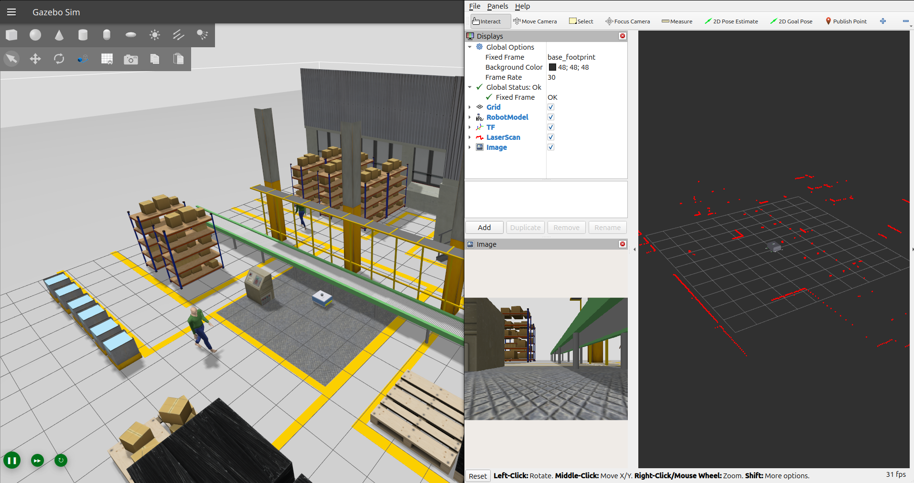
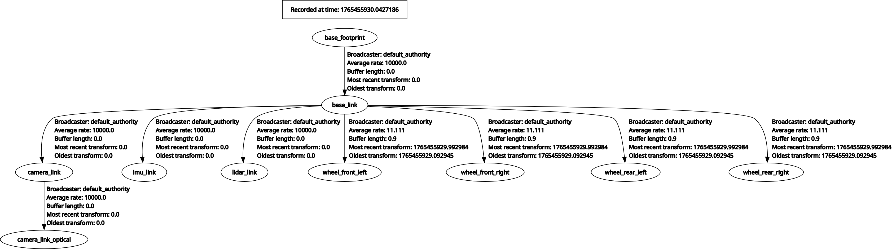
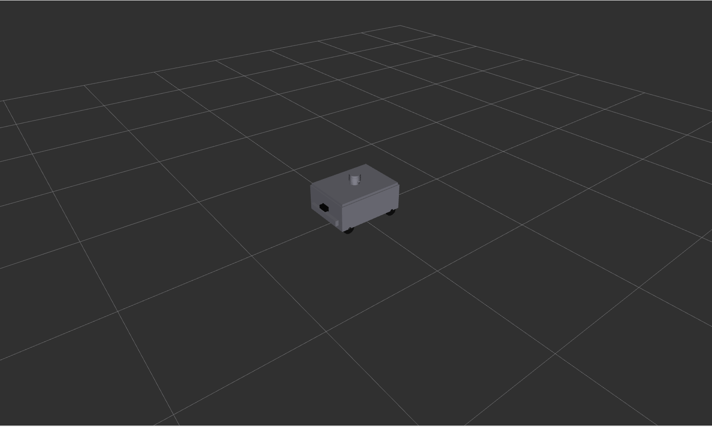
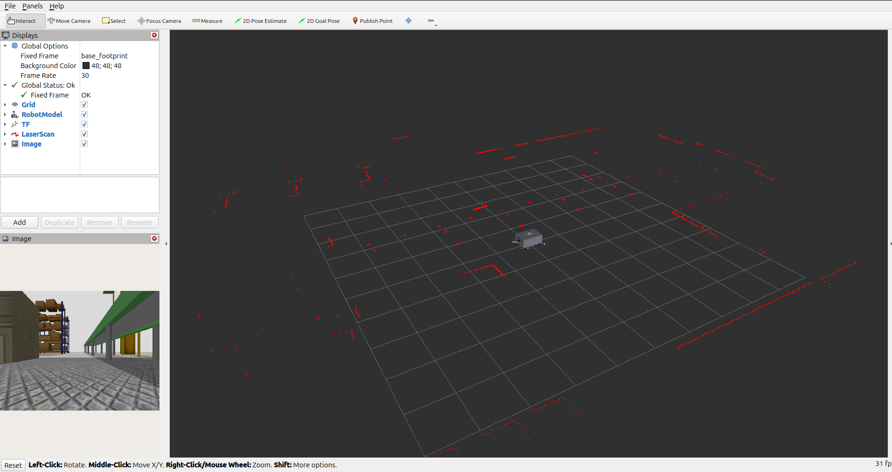
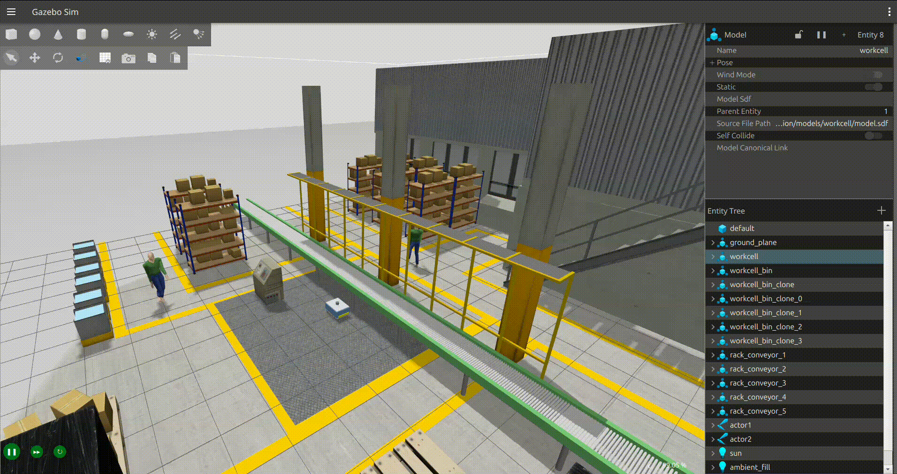

# AMR Description Package


<div align="center">
  
  <br/>
  <em>Figure 1: The AMR Robot in the Warehouse Simulation Environment</em>
</div>

## 📖 Overview

The **`amr_description`** package is the core visualization and simulation module for the Warehouse Autonomous Mobile Robot (AMR) project. It defines the robot's physical structure, visual appearance, collision properties, and kinematic relationships using **URDF** (Unified Robot Description Format) and **Xacro** (XML Macros).

This package is specifically engineered for **ROS 2 Jazzy** and **Gazebo Harmonic** (gz-sim), providing a high-fidelity simulation environment that bridges the gap between virtual development and real-world deployment. It serves as the foundational layer for:

* **Localization & Mapping (SLAM)**
* **Autonomous Navigation (Nav2)**
* **Motion Control**
* **Sensor Fusion**

---

## ✨ Key Features

**Dual-Mode Drive System**:

* **Differential Drive**: Standard 4-wheel skid-steer configuration for robust navigation. Ideal for standard navigation tasks.
* **Mecanum Drive**: Omnidirectional mobility with lateral strafing for tight warehouse aisles. Optimized for SLAM tasks.

**High-Fidelity Simulation**:

* Physics-based wheel friction models (anisotropic for mecanum wheels)
* Realistic sensor noise (Gaussian) for LIDAR, IMU, and Camera
* Accurate inertial properties for stable dynamics

**Modular & Customizable**:

* Component-based Xacro macros (`wheel`, `lidar`, `camera`, `imu`)
* Centralized material and property definitions
* Easy to extend and modify

**Gazebo Harmonic Integration**:

* Native `gz-sim` plugins for drive control and odometry
* Seamless ROS 2 <-> Gazebo communication via `ros_gz_bridge`

**Pre-Configured Environments**:

* Three warehouse worlds: Small, Medium, and Large
* Realistic layouts with obstacles and shelves for testing

---

## 🤖 System Architecture

### 1. Robot Model

The robot is modeled as a 4-wheeled rectangular chassis with a multi-layer design.

* **Chassis**: 0.6m x 0.45m x 0.25m, Mass: 15.0 kg.
* **Wheels**: 0.1m diameter, positioned for stability.
* **Sensors**:
  * **LIDAR**: Top-mounted 2D laser scanner (360° FOV, 10m range).
  * **Camera**: Front-facing RGB camera (640x480, 30fps).
  * **IMU**: Internally mounted 6-DOF inertial measurement unit.

### 2. Coordinate Frames (TF Tree)

The package publishes a standard ROS 2 coordinate frame hierarchy:

<div align="center">
  
  <br/>
  <em>Figure 2: The Robot's Coordinate Frame Tree (generated via rqt_tf_tree)</em>
</div>

### 3. Gazebo Plugins

The simulation utilizes the following `gz-sim` systems:

* **`DiffDrive` / `MecanumDrive`**: Handles velocity commands (`cmd_vel`) and wheel kinematics.
* **`OdometryPublisher`**: Computes and publishes odometry data (`odom` -> `base_footprint`).
* **`JointStatePublisher`**: Publishes the state of all moving joints.
* **`Sensors`**: `gpu_lidar`, `camera`, and `imu` plugins for data generation.

---

## 📸 Visual Gallery

### Robot & Sensors

| **Robot Model (URDF)** | **Sensor Visualization** |
|:---:|:---:|
|  |  |
| *Detailed view of the robot chassis and sensors* | *LIDAR scans and Camera feed in RViz* |

### Drive Modes

| **Differential Drive** | **Mecanum Drive** |
|:---:|:---:|
|  |  |
| *Standard skid-steer navigation* | *Omnidirectional movement for SLAM* |

### Simulation Environments

| **Small Warehouse** | **Medium Warehouse** | **Large Warehouse** |
|:---:|:---:|:---:|
|  |  |  |
| *Basic testing environment* | *Standard layout with shelves* | *Complex environment with obstacles* |

---

## 🚀 Installation & Build

### Prerequisites

* **OS**: Ubuntu 24.04 (Noble Numbat)
* **ROS 2**: Jazzy Jalisco
* **Simulator**: Gazebo Harmonic

### 1. Clone the Repository

```bash
cd ~/AMR/
# Clone your repository here if not already present
```

### 2. Install Dependencies

Use `rosdep` to install all required system dependencies:

```bash
cd ~/AMR/ros2_ws
rosdep install --from-paths src --ignore-src -r -y
```

### 3. Build the Package

```bash
colcon build --packages-select amr_description --symlink-install
source install/setup.bash
```

---

## 🎮 Usage Guide

### 1. Launching Simulation

The primary launch file is `sim.launch.py`. It handles the entire simulation stack: Gazebo, Spawning, Bridges, and RViz.

#### Option A: Standard Differential Drive (Default)

Use this for general navigation testing where omnidirectional movement is not required.

```bash
ros2 launch amr_description sim.launch.py
```

#### Option B: Mecanum Drive (Omnidirectional)

Use this for SLAM mapping or when testing holonomic control algorithms.

```bash
ros2 launch amr_description sim.launch.py drive_mode:=mecanum
```

#### Option C: Custom World

Load a specific warehouse environment.

```bash
ros2 launch amr_description sim.launch.py world:=$(ros2 pkg prefix amr_description)/share/amr_description/worlds/large_warehouse.sdf
```

### 2. Visualizing in RViz

To inspect the URDF model, joint limits, and sensor placements without running the heavy simulation:

```bash
ros2 launch amr_description display.launch.py
```

* **GUI Controls**: A window will appear allowing you to manually rotate the wheels using sliders.

---

## ⚙️ Configuration Reference

### Launch Arguments

| Argument | Default Value | Description |
| :--- | :--- | :--- |
| `drive_mode` | `diff` | Selects the drive plugin and wheel friction properties. Options: `diff`, `mecanum`. |
| `world` | `medium_warehouse.sdf` | Absolute path to the Gazebo world file (`.sdf`). |
| `model` | `robot.xacro` | Absolute path to the robot URDF/Xacro file. |
| `rviz` | `true` | Boolean to enable/disable RViz2 launch. |
| `use_sim_time` | `true` | Synchronizes ROS time with Gazebo simulation time. |
| `use_gui` | `true` | Enables the Joint State Publisher GUI (only in `display.launch.py`). |

### ROS 2 Topics

| Topic Name | Message Type | Publisher | Description |
| :--- | :--- | :--- | :--- |
| `/cmd_vel` | `geometry_msgs/Twist` | User/Nav2 | Velocity commands to control the robot. |
| `/odom` | `nav_msgs/Odometry` | Gazebo | Robot odometry (position & velocity) relative to start. |
| `/scan` | `sensor_msgs/LaserScan` | Gazebo | 2D LIDAR scan data. |
| `/camera/image_raw` | `sensor_msgs/Image` | Gazebo | Raw RGB image data from front camera. |
| `/camera/camera_info` | `sensor_msgs/CameraInfo` | Gazebo | Camera calibration and metadata. |
| `/imu` | `sensor_msgs/Imu` | Gazebo | Linear acceleration and angular velocity. |
| `/joint_states` | `sensor_msgs/JointState` | Gazebo | Angular position of wheel joints. |
| `/tf` / `/tf_static` | `tf2_msgs/TFMessage` | RobotStatePublisher | Dynamic and static transforms. |

---

## 📂 Directory Structure

```text
amr_description/
├── launch/
│   ├── display.launch.py    # RViz visualization launch
│   └── sim.launch.py        # Main Gazebo simulation launch
├── meshes/                  # 3D assets (STL/DAE)
├── rviz/
│   └── display_config.rviz  # Default RViz view configuration
├── urdf/
│   ├── materials.xacro      # Color and material definitions
│   ├── robot.xacro          # Main robot assembly
│   ├── sensor_macro.xacro   # Macros for LIDAR, Camera, IMU
│   └── wheel_macro.xacro    # Macro for wheels with friction params
└── worlds/
    ├── small_warehouse.sdf  # Simple test environment
    ├── medium_warehouse.sdf # Standard warehouse with shelves
    └── large_warehouse.sdf  # Complex environment with obstacles
```

---

## 🛠 Customization

### Adjusting Physical Properties

To change the robot's size or mass, edit `urdf/robot.xacro`:

```xml
<xacro:property name="chassis_length" value="0.6"/>
<xacro:property name="chassis_mass" value="15.0"/>
```

### Modifying Sensor Parameters

To change LIDAR range or Camera resolution, edit `urdf/sensor_macro.xacro`:

```xml
<!-- Inside lidar_sensor macro -->
<range>
  <min>0.05</min>
  <max>10.0</max> <!-- Change max range here -->
</range>
```

---

## 📧 Maintainer

**Yossef Hady**:
*Robotics Software Engineer*

Email: <yossefhady007@gmail.com>

🔗 [GitHub](https://github.com/yossefhady/) | [LinkedIn](https://www.linkedin.com/in/yossefhady/)


> ❤️ Star this repo if you find it useful or want to follow development!
