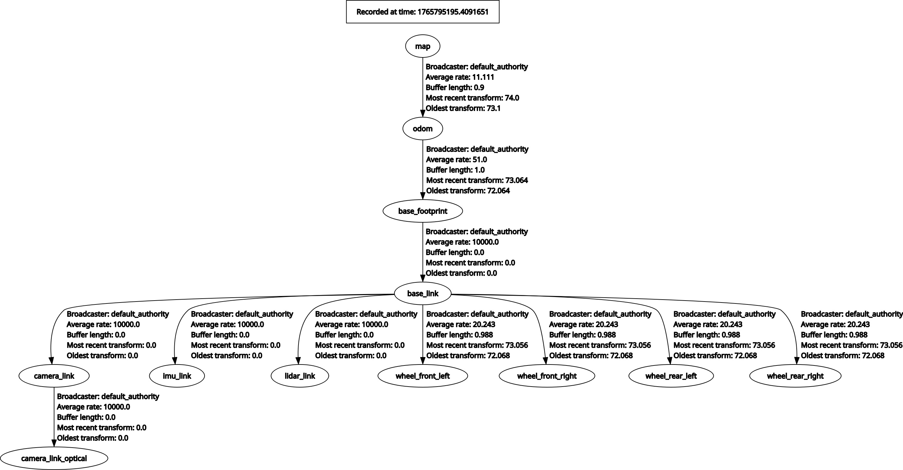

# AMR Navigation Package


<div align="center">
  <!-- Placeholder for a banner if you have one, otherwise we can skip or use a generic one -->
  <!--  -->
</div>

## 📖 Overview

The **`amr_navigation`** package provides the autonomous navigation capabilities for the Warehouse Autonomous Mobile Robot (AMR). It leverages the **ROS 2 Navigation 2 (Nav2)** stack and **Robot Localization** to enable robust path planning, obstacle avoidance, and precise state estimation.

This package acts as the "brain" of the robot's movement, taking map data from `amr_slam` and sensor data from `amr_bringup` to safely drive the robot to its goal.

---

## ✨ Key Features

**Advanced Path Planning**:
* **Global Planner**: Uses `NavfnPlanner` (A* / Dijkstra) to compute optimal paths on static maps.
* **Local Controller**: Uses `RegulatedPurePursuitController` with a `RotationShim` for smooth path following and precise goal alignment.

**Robust State Estimation**:
* **Sensor Fusion**: Integrates Wheel Odometry and IMU data using an **Extended Kalman Filter (EKF)**.
* **Drift Correction**: Provides a stable `odom` -> `base_footprint` transform, essential for long-duration operation.

**Dynamic Obstacle Avoidance**:
* **Costmaps**: Multi-layered costmaps (Obstacle, Inflation) to detect and avoid static and dynamic objects in real-time.
* **Recovery Behaviors**: Automated recovery sequences (Spin, Backup, Wait) to escape stuck situations.

---

## 🤖 System Architecture

### 1. Navigation Stack (Nav2)

We utilize the standard Nav2 architecture with a custom configuration tuned for warehouse environments.

| Component | Plugin | Purpose |
| :--- | :--- | :--- |
| **Planner** | `NavfnPlanner` | Computes the global path from start to goal. |
| **Controller** | `RegulatedPurePursuit` | Generates velocity commands (`cmd_vel`) to follow the path. |
| **Smoother** | `VelocitySmoother` | Ensures acceleration limits are respected for smooth motion. |
| **Behaviors** | `Spin`, `Backup`, `Wait` | Recovery actions when the robot is stuck. |

### 2. Sensor Fusion (EKF)

To ensure precise localization, we use `robot_localization` to fuse data sources:

*   **Input 1**: Wheel Odometry (`/odom`) -> Provides Linear Velocity (`vx`, `vy`) and Angular Velocity (`vtheta`).
*   **Input 2**: IMU (`/imu`) -> Provides Orientation (`theta`) and Angular Velocity (`vtheta`).
*   **Output**: Filtered Odometry (`/odometry/filtered`) and the `odom` TF frame.

### 3. Coordinate Frames

The navigation system relies on a standard TF tree. `amcl` (or SLAM) provides the map correction, while EKF provides the smooth odometry.

<div align="center">
  
  <br>
  <em>Figure 1: TF Tree Structure (map -> odom -> base_footprint)</em>
</div>

---

## ⚙️ Configuration & Tuning

The system is highly tuned for the specific dynamics of our AMR. Key parameters in `params/nav2_params.yaml`:

### Controller Settings
| Parameter | Value | Description |
| :--- | :--- | :--- |
| `desired_linear_vel` | **1.0 m/s** | Maximum driving speed. |
| `rotate_to_heading_angular_vel` | **2.0 rad/s** | Speed of in-place rotation at the goal. |
| `rotate_to_heading_min_angle` | **0.10 rad** | Minimum angle error to trigger in-place rotation. |
| `max_decel` | **-2.5 m/s²** | Strong braking to prevent overshooting. |

### Goal Tolerance
| Parameter | Value | Description |
| :--- | :--- | :--- |
| `xy_goal_tolerance` | **0.10 m** | Allowed position error (10 cm). |
| `yaw_goal_tolerance` | **0.15 rad** | Allowed heading error (~8.5 degrees). |

> **Note**: `yaw_goal_tolerance` must be slightly larger than `rotate_to_heading_min_angle` to prevent oscillation at the goal.

---

## 🚀 Launch System

### Main Navigation Launch
The primary entry point for the navigation stack.

```bash
ros2 launch amr_navigation nav.launch.py map:=/path/to/map.yaml use_sim_time:=true
```

**Arguments:**
*   `map`: Absolute path to the map `.yaml` file.
*   `use_sim_time`: Set to `true` for simulation, `false` for real hardware.
*   `params_file`: Path to custom nav2 params (default: `params/nav2_params.yaml`).

### EKF Launch
Starts the sensor fusion node. Usually included automatically by `nav.launch.py` or `bringup`.

```bash
ros2 launch amr_navigation ekf.launch.py
```

---

## 🛠️ Troubleshooting

| Issue | Possible Cause | Solution |
| :--- | :--- | :--- |
| **Robot spins at goal** | Goal tolerance is too tight. | Increase `yaw_goal_tolerance` or decrease `rotate_to_heading_min_angle`. |
| **Overshooting goal** | Deceleration is too low. | Increase `max_decel` (e.g., to `-2.5`) or reduce `desired_linear_vel`. |
| **Stops too far from walls** | Inflation radius is too large. | Decrease `inflation_radius` or increase `cost_scaling_factor`. |
| **"Control loop missed rate"** | CPU overload. | Reduce `controller_frequency` (e.g., to 10Hz) or costmap resolution. |
