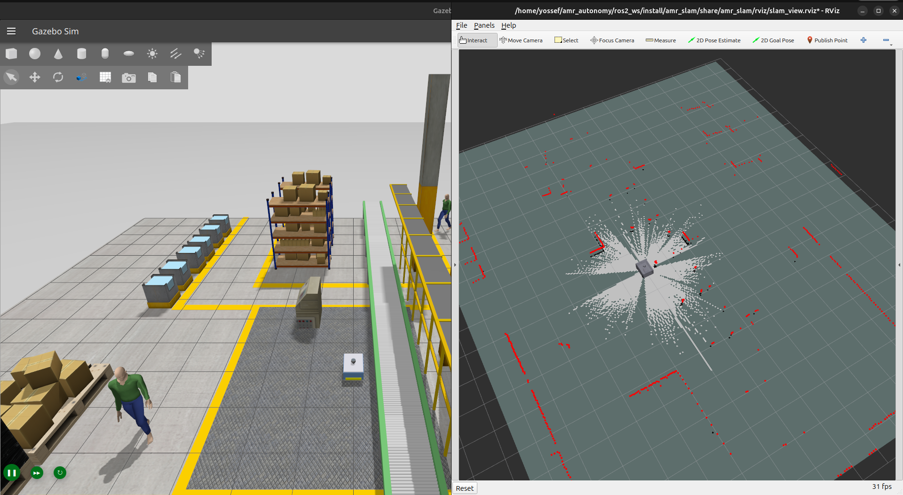
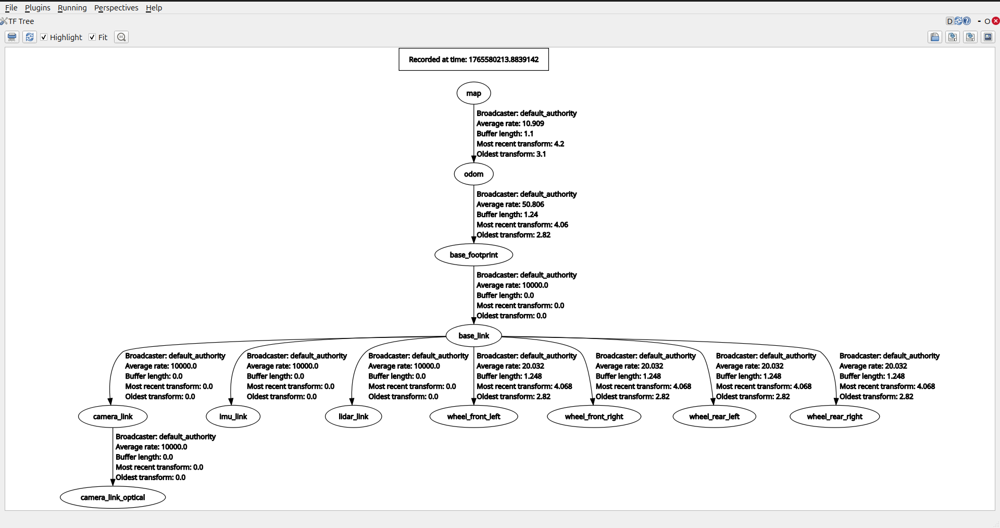
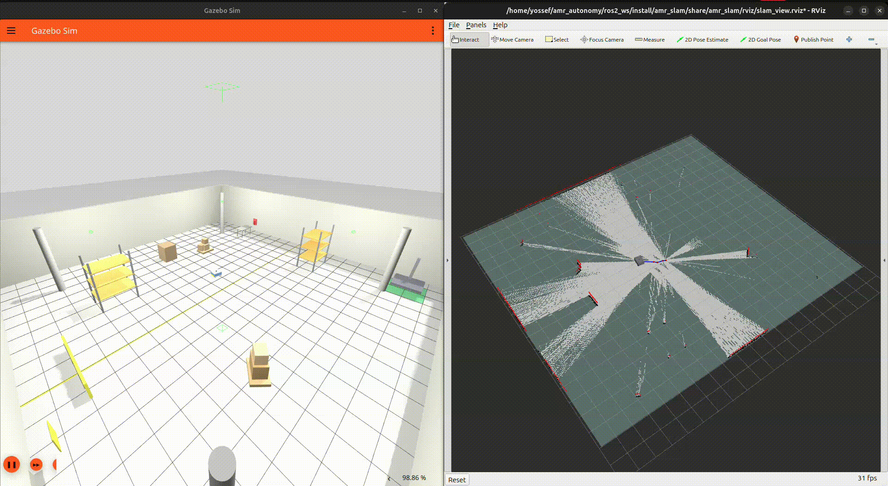
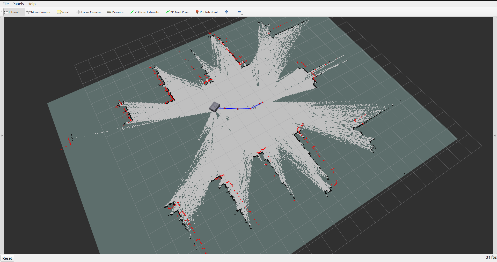
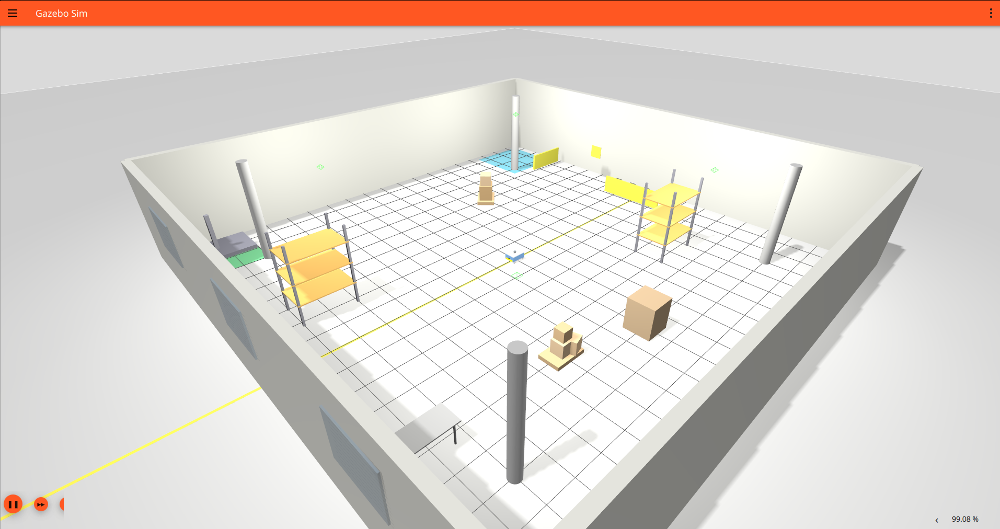
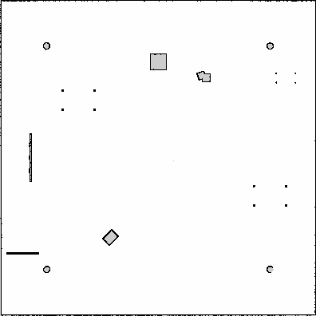
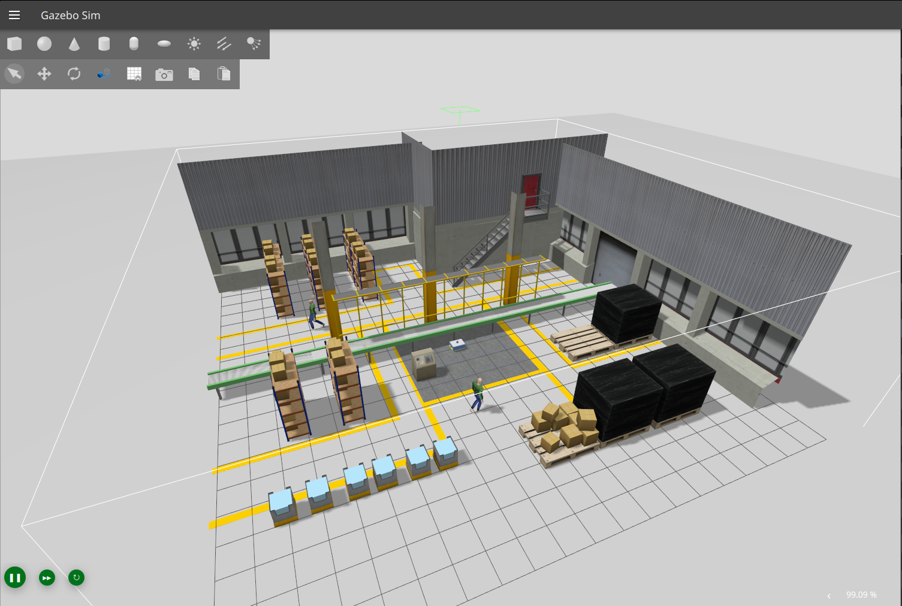

# AMR SLAM Package


<div align="center">
  
</div>

## 📖 Overview

The **`amr_slam`** package provides Simultaneous Localization and Mapping (SLAM) capabilities for the Warehouse Autonomous Mobile Robot (AMR). It leverages **`slam_toolbox`** to offer robust mapping, localization, and "lifelong SLAM" features, allowing the robot to map large environments, save its state, and resume mapping later.

This package is designed to work seamlessly with `amr_description` (simulation) and `amr_navigation` (path planning), providing the foundational map data required for autonomous operation.

---

## ✨ Key Features

**Lifelong SLAM**:

* **Resume Mapping**: Ability to load a previously saved map state and extend it.
* **Dynamic Environments**: Updates the map over time as the environment changes.

**Dual Map Management**:

* **Serialized Maps**: Saves full SLAM state (`.posegraph`, `.data`) for resuming sessions.
* **Standard Maps**: Saves occupancy grids (`.pgm`, `.yaml`) for standard AMCL/Nav2 navigation.

**Flexible Modes**:

* **Mapping**: Fresh start for new environments.
* **Continue Mapping**: Load and extend existing maps.
* **Localization**: Pure localization against an existing map without modification.

---

## 🤖 System Architecture

### 1. SLAM Toolbox Integration

We utilize `slam_toolbox` in **Online Async** mode for mapping and **Localization** mode for pure localization.

### 2. Map Storage Strategy

To support both resuming work and standard navigation, we employ a custom map saver (`save_map.py`) that stores data in two locations:

| Format | Path | Purpose |
| :--- | :--- | :--- |
| **Serialized** (`.posegraph/.data`) | `src/amr_slam/maps/<world>/` | Resuming mapping sessions (Lifelong SLAM). |
| **Standard** (`.pgm/.yaml`) | `src/amr_navigation/maps/<world>/` | Input for Nav2 / AMCL. |

### 3. Coordinate Frames

The SLAM system relies on a standard TF tree structure. `slam_toolbox` publishes the `map` -> `odom` transform, while the robot description handles `odom` -> `base_link`.

<div align="center">
  
  <br>
  <em>Figure 1: Standard TF Tree (map -> odom -> base_link)</em>
</div>

---

## 📸 Visual Gallery

### Mapping Process

| **Real-time Mapping** | **RViz Visualization** |
|:---:|:---:|
|  |  |
| *Live mapping with Mecanum drive* | *SLAM Toolbox visualization in RViz* |

### Mapping Results

| **Environment (Gazebo)** | **Generated Map (Result)** |
|:---:|:---:|
| **Small Warehouse**<br> | <br>*Basic mapping test* |
| **Medium Warehouse**<br> | <br>*Complex layout with shelves* |
| **Large Warehouse**<br> | <br><h1>🔒</h1>**Challenge Locked**<br><em>Waiting for you to test it yourself!</em> 😉 |

---

## 🚀 Installation & Build

### Prerequisites

* **OS**: Ubuntu 24.04 (Noble Numbat)
* **ROS 2**: Jazzy Jalisco
* **Dependencies**: `slam_toolbox`, `nav2_map_server`

### 1. Clone the Repository

```bash
cd ~/AMR/
# Clone your repository here if not already present
```

### 2. Install Dependencies

Use `rosdep` to install all required system dependencies:

```bash
cd ~/AMR/ros2_ws
rosdep install --from-paths src --ignore-src -r -y
```

### 3. Build the Package

```bash
colcon build --packages-select amr_slam --symlink-install
colcon build --packages-select amr_bringup --symlink-install 
source install/setup.bash
```

---

## 🎮 Usage Guide

### 1. Launching SLAM

The primary entry point is via `amr_bringup`, but you can launch SLAM independently for testing.

#### Option A: Fresh Mapping (Default)

Start mapping a new environment from scratch.

```bash
ros2 launch amr_slam slam.launch.py
```

#### Option B: Continue Mapping

Load a previously saved serialized map and continue adding to it.

```bash
ros2 launch amr_slam continue_mapping.launch.py world_name:=<world_name>
```

*Example*: `ros2 launch amr_slam continue_mapping.launch.py world_name:=medium_warehouse`

#### Option C: Localization Only

Load a map and localize within it (no map updates).

```bash
ros2 launch amr_slam localization.launch.py world_name:=<world_name>
```

*Example*: `ros2 launch amr_slam localization.launch.py world_name:=medium_warehouse`

### 2. Saving Maps

**Crucial Step**: Use the custom saver script to ensure maps are saved in the correct formats and locations.

```bash
ros2 run amr_slam save_map.py <world_name>
```

*Example*: `ros2 run amr_slam save_map.py medium_warehouse`

---

## ⚙️ Configuration Reference

### Launch Arguments

| Argument | Default | Description |
| :--- | :--- | :--- |
| `use_sim_time` | `true` | Use simulation time (set to `false` for real robot). |
| `slam_params_file` | `params/slam_params.yaml` | Path to SLAM configuration file. |
| `world_name` | `medium_warehouse` | Name of the world/map to load (for continue/localization modes). |

### Parameters (`slam_params.yaml`)

Key parameters configured for this robot:

* `max_laser_range`: 20.0m
* `map_update_interval`: 5.0s
* `resolution`: 0.05m

---

## 📧 Maintainer

**Yossef Hady**:
*Robotics Software Engineer*

Email: <yossefhady53@gmail.com>

🔗 [GitHub](https://github.com/yossefhady/) | [LinkedIn](https://www.linkedin.com/in/yossefhady/)


> ❤️ Star this repo if you find it useful or want to follow development!